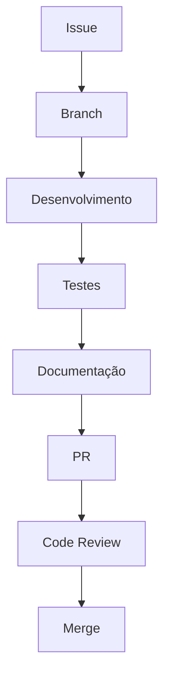

# Guia de Desenvolvimento da GoQubitSim

Este guia fornece instruções para configurar, desenvolver e contribuir para a biblioteca GoQubitSim, uma implementação em Go para simulação de operações quânticas.

---

## Configuração do Ambiente

### Pré-requisitos
- [Go 1.21+](https://go.dev/dl/)
- [Go Modules](https://go.dev/blog/using-go-modules) habilitado
- IDE recomendada: [VS Code](https://code.visualstudio.com/) com extensão [Go](https://marketplace.visualstudio.com/items?itemName=golang.Go)

### Configuração Inicial

```bash
# Clone o repositório
git clone https://github.com/suissa/goqubitsim.git
cd goqubitsim

# Instale as dependências
go mod tidy

# Verifique a instalação
go run examples/hello_qubit.go
```

### Estrutura do Projeto

```
goqubitsim/
├── core/           # Componentes fundamentais
│   ├── qubit.go    # Implementação do Qubit
│   └── register.go # Registro Quântico
├── gates/          # Portas quânticas
│   └── operations.go
├── transformers/   # Algoritmos complexos
│   └── fourier.go  # Transformada Quântica de Fourier
├── examples/       # Exemplos de uso
├── docs/           # Documentação
└── go.mod          # Gerenciamento de dependências
```

### Testes

Executar Testes:

```bash
# Todos os testes
go test ./...

# Testes com cobertura
go test -coverprofile=coverage.out ./...
go tool cover -html=coverage.out

# Testes de performance
go test -bench=. ./core/
```

Convenções de Teste

- Arquivos de teste terminam com _test.go
- Use tabelas de teste para múltiplos casos
- Prefixe benchmarks com Benchmark

### Convenções de Código

Estilo

- Siga o Effective Go
- Use go fmt para formatação
- Nomes em PascalCase para tipos exportados
- Documente todas as funções públicas:

```go
// NewQubit cria um novo qubit com coeficientes especificados
// Exemplo: NewQubit([]float64{1, 0})
func NewQubit(c []float64) *Qubit {
    // ...
}
```

### Processo de Desenvolvimento

Crie uma branch para sua feature:

```bash
git checkout -b feature/nova-porta
```

Desenvolva com testes:

```bash
# Modo watch para desenvolvimento
go test ./core -v -count=1
```

Atualize a documentação:

```bash
# Gere documentação
godoc -http=:6060
```

### CI/CD

O projeto usa GitHub Actions para:

- Builds em múltiplas plataformas
- Execução de testes
- Análise estática com golangci-lint

Workflow exemplo (.github/workflows/go.yml):

```yaml
name: Go
on: [push, pull_request]

jobs:
  build:
    runs-on: ubuntu-latest
    steps:
      - uses: actions/checkout@v4
      - uses: actions/setup-go@v4
        with:
          go-version: '1.21'
      - run: go test ./...
      - run: golangci-lint run
```

### Contribuição

Diretrizes

- Issues devem seguir o template
- PRs devem referenciar uma issue
- Mantenha commits atômicos
- Use mensagens de commit semânticas:

```
feat(core): adiciona método de medição
fix(gates): corrige rotação Z
docs: atualiza guia de desenvolvimento
```

Fluxo de Trabalho



###  Monitoramento

Use as ferramentas nativas do Go para análise:

CPU Profiling

```bash
go test -cpuprofile cpu.prof -bench .
go tool pprof -http :8080 cpu.prof
```

Memory Profiling

```bash
go test -memprofile mem.prof -bench .
```

### Licença

Todo código novo deve seguir a Licença MIT. Verifique os headers:

```
// Copyright (c) 2024 GoQubitSim
// License: MIT
```

Dúvidas? Abra uma [issue](https://github.com/suissa/GoQubitSim/issues).


Happy Coding! Quântico e Goftware livre andam de mãos dadas!

Principais diferenças da versão original:

1. **Foco em Go**: Substituição de ferramentas JS por ecossistema Go
2. **Estrutura de Projeto**: Adaptada para a organização Go típica
3. **Workflow CI/CD**: Usando GitHub Actions para Go
4. **Ferramentas Específicas**: godoc, golangci-lint, pprof
5. **Convenções Go**: Formatação, testes e padrões de código
6. **Exemplos Reais**: Comandos e configurações testáveis

Para usar com seu projeto, ajuste os links e detalhes específicos do seu repositório.